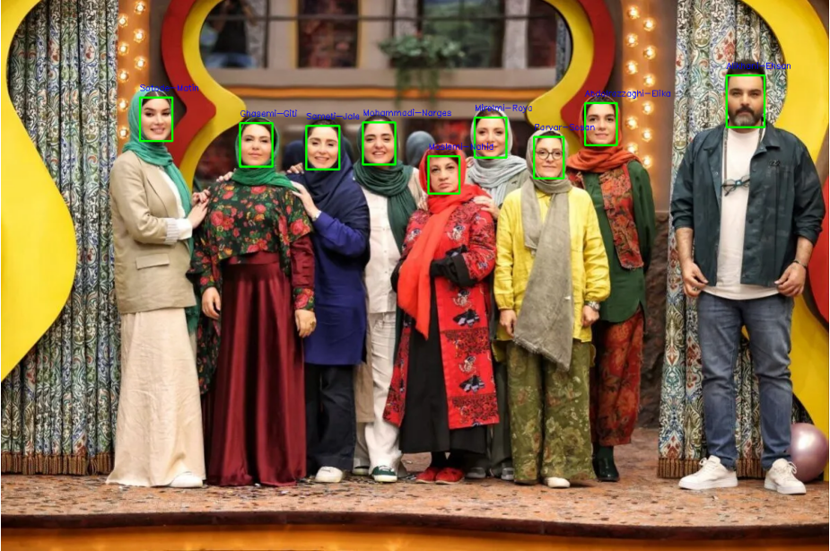

# Face Recognition Project

این پروژه برای شناسایی چهره و مدیریت پایگاه داده تصاویر طراحی شده است. از کتابخانه InsightFace برای تشخیص و شناسایی چهره و از SQLite برای مدیریت پایگاه داده استفاده می‌شود.

## ساختار پروژه

```bash
Final_Project/
├── images/
│   ├── label/                  # پوشه تصاویر فردی
│   └── group_img/              # پوشه تصاویر گروهی
├── database/
│   └── face_db.sqlite          # دیتابیس SQLite
├── src/
│   ├── face_detection.py       # فایل نمونه برای تشخیص چهره
│   ├── face_recognition.py     # فایل نمونه برای شناسایی چهره
│   └── main.py                 # فایل اصلی کد
├── config.yaml                 # فایل کانفیگ پروژه
├── requirements.txt            # فایل پکیج‌های مورد نیاز پایتون
└── README.md                   # مستندات پروژه
```

## راه‌اندازی

### 1. نصب پکیج‌های مورد نیاز

ابتدا فایل `requirements.txt` را ایجاد کنید و سپس با دستور زیر پکیج‌ها را نصب کنید:

```bash
pip install -r requirements.txt
```

### 2. تنظیمات فایل کانفیگ

فایل `config.yaml` شامل مسیرهای مهم دیتابیس و تصاویر است. ساختار این فایل به شکل زیر است:

```yaml
# config.yaml

database:
  path: "database/face_db.sqlite"    # مسیر دیتابیس SQLite

images:
  label_dir: "images/label/"         # مسیر تصاویر شخصی
  group_img_dir: "images/group_img/" # مسیر تصاویر گروهی
```

مطمئن شوید که مسیرهای فایل کانفیگ با سیستم شما همخوانی دارند.

### 3. اجرای پروژه

برای اجرای پروژه، به دایرکتوری `src` بروید و دستور زیر را اجرا کنید:

```bash
python main.py
```

این دستور پایگاه داده چهره‌ها را آماده‌سازی کرده و تصاویر گروهی را پردازش می‌کند.

## دمو

### شمای تصویری از اجرای پروژه

در این بخش، یک شمای تصویری از نحوه اجرای موفقیت‌آمیز پروژه مشاهده می‌کنید:

<p align="center">

</p>

### نمایش نتایج

پس از اجرای پروژه، نتایج شناسایی چهره‌ها در تصاویر گروهی به صورت خودکار در دیتابیس ذخیره می‌شوند. همچنین، می‌توانید تصاویر مرتبط با برچسب‌های مشخص‌شده را از دیتابیس بازیابی کنید.

### عملکرد اصلی

- `prepare_and_save_face_database(known_faces_dir)`: آماده‌سازی پایگاه داده چهره‌ها و ذخیره در SQLite.
- `load_from_sqlite()`: بارگذاری چهره‌ها از دیتابیس.
- `process_group_images(group_images_dir)`: پردازش تصاویر گروهی و ذخیره نتایج.
- `retrieve_images_by_labels(required_labels, excluded_labels)`: بازیابی تصاویر بر اساس برچسب‌های مورد نظر و حذف برچسب‌های غیرمجاز.
- `main()`: اجرای کامل جریان کاری پروژه.

## یادداشت‌ها

- فایل `config.yaml` به عنوان نقطه کلیدی برای تنظیمات استفاده می‌شود.
- پوشه‌های `images/label` و `images/group_img` باید به درستی با تصاویر مناسب پر شوند.
- استفاده از داکر می‌تواند محیطی پایدار و هماهنگ فراهم کند.

---

در صورت بروز مشکل یا نیاز به راهنمایی بیشتر، به مستندات مراجعه کنید یا با پشتیبان پروژه تماس بگیرید.
